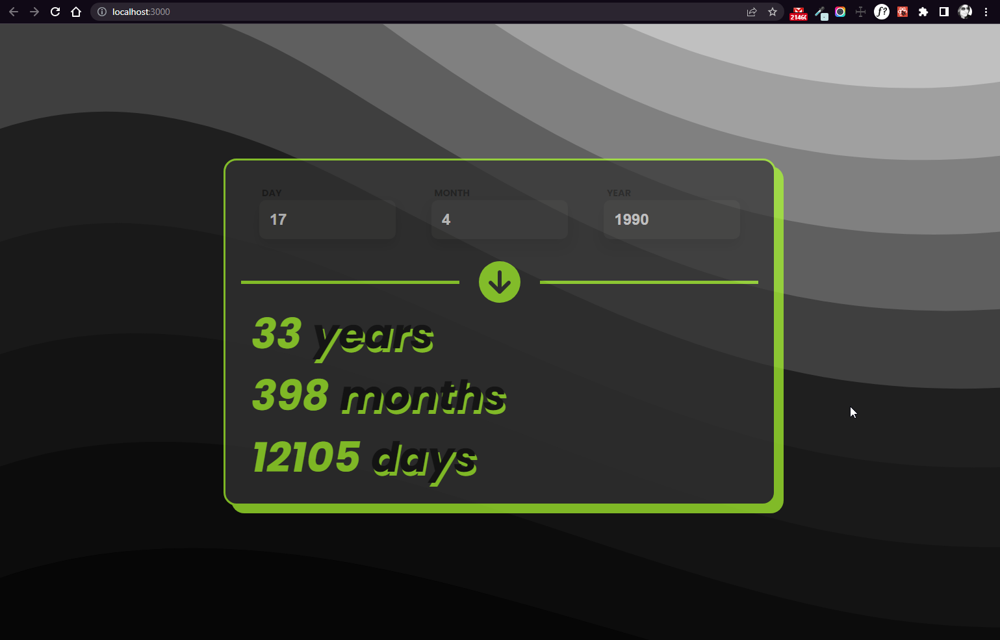

# Age-calculator

## Description

Age Calculator is a web-app that allows you to calculate your age based on the date of birth you provide.

## Features

- Enter your birthdate (day, month, and year) in the input fields.
- The application validates the input and displays error messages if the values are invalid.
- Click the "Calculate Age" button to calculate your age.
- The application displays your age in years, months, and days.

## Technology

  
 
  
  

## Demo

To see a live demo of the Age-calculator, visit [Demo](https://www.massidev.com/portfolio/age-calculator/).

## Installation

To run the Age-calculator locally, follow these steps:

1. Clone the repository: `git clone https://github.com/massi-17/age-calculator.git`
2. Navigate to the project directory: `cd age-calculator`
3. Open the `index.html` file in your preferred web browser.

## Contributing

Contributions are welcome! If you want to contribute to this Age-calculator, please follow these steps:

1. Fork the repository.
2. Create a new branch: `git checkout -b feature/your-feature`.
3. Make your changes and commit them: `git commit -m 'Add your feature'`.
4. Push to the branch: `git push origin feature/your-feature`.
5. Submit a pull request.

